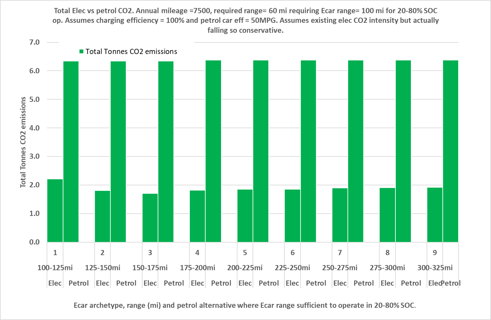

# Capstone_Evaluating_Domestic_Electrification_Measures 

**Capstone_Evaluating_Domestic_Electrification_Measures** is my final (capstone) project carried out in October 2025 as part of the Code Institute Data Analytics and AI Bootcamp.

I have saved all files in Github.  These include this readme file, raw and processed data files, Jupyter notebooks, and the Power BI dashboard (.pbix) file.

The project repository is located here:- 
https://github.com/jeremystambaugh305/Capstone_Evaluating_Domestic_Electrification_Measures

and the project planning is located here:-
https://github.com/users/jeremystambaugh305/projects/5

Context

The UK government is currently committed to reducing net carbon emissions to zero by 2050. Significant progress has been achieved to date in reducing the carbon emissions of power generation but less so in other areas such as heat generation and transport which currently use mainly fossil fuels in the UK. Electrifying heating and transport has emerged as a key strategy to decarbonise these sectors, i.e. replacing fossil fuelled vehicles with electric vehicles and fossil fuelled heating with electric heating. In a domestic setting, this would typically mean, acquiring an electric car (Ecar) rather than a conventional petrol or diesel car or installing an air source heat pump (ASHP) rather than a conventional gas or oil fired boiler. Typically this would be done when the householder needs or wishes to replace, or in some cases acquire for the first time, a car or heating system. Though not a necessity, installing a solar PV array (solarPV), typically on the roof, is another significant measure which will contribute in decarbonising the electricity supply and hopefully save the householder money over its lifetime.

# 

## Dataset Content
This project will use a number of datasets sourced from Kaggle, UK government, other public sources and at one private source (my smart meter). These will include techno-economic databases with costs and technical information for the various technology options, annual heating and electricity consumption statistics for different household categories, and half hourly electricity and gas consumption data.

All source datasets are expected to be well below the 100MB limit for an individual file in a Github repository using the standard free version of Github. However, cost and carbon savings will then be calculated for various scenarios within Jupyter notebooks which will output large csv files which will all be read into Power BI to facilitate the dashboards. I envisage having 3 csv files, one for Ecars, one for Solar PV and one for ASHPs and then just one Power BI file with multiple sheets so these 3 technologies can be readily compared without having to open dashboard files. Each of the csv files or the Power BI dashboard .pbix file could approach the 100MB limit. I will estimate the size of each of the csv files and of the pbix dashboard file based on dummy outputs and dashboards and monitor their size during development. I will tailor and where necessary, curtail the level of detail and formatting of outputs and underlying analysis to give the most informative insights possible within the 100MB file size limits. An initial trial of the Ecar csv file and loading this into Power BI, the pbix filesize displayed by Windows Explorer is only around 1/6th of the size displayed for the underlying csv file. This implies the pbix is likely to be well below 100MB even if it contains data from 3 csv files approaching 100MB. According to a Bing Copliot search this could be due to data compression in Power BI but it is also possible the file size did not correctly display in Windows Explorer so I will still need to monitor all file sizes closely in Github. 

The raw datasets used are as below:-

#### Cheapestelectriccars-EVDatabase_2023.csv
<Cheapestelectriccars-EVDatabase_2023.csv> is a techno-economic data (including up front costs, battery size, efficiency) obtained from Kaggle at https://www.kaggle.com/datasets/kkhandekar/cheapest-electric-cars. According to the documentation this was webscraped from another electrical vehicle database https://ev-database.org. <Cheapestelectriccars-EVDatabase_2023.csv> was produced in 2023 so is already outdated. For example as explained below, I found in web searches that UK prices have reduced substantially for many of these cars, some are no longer being sold in the UK and some new cars have entered the UK market. Due to the first point, costs and therefore lifetime savings which will be calculated using this dataset are likely to be conservative.  
Some cars did not have UK prices so I researched some online and found some had only recently entered the UK market and some have still not entered the UK market. So I assumed these were all not yet on the UK market in 2023 and removed them from the dataset.
Otherwise, I have kept to this dataset as it is, as I know of no more recent comprehensive set. I have not updated prices based on the few web searches I did as this would lead to inconsistencies and I did not have sufficient time budget to comprehensively update the dataset. But updating this dataset would be a potential significant future improvement.

I produced several visualisations in the Jupyter notebook to help examine and present the dataset. 

I examined two prominent cost outliers and identified them as luxury cars with their prices plausible based on web searches. So I retained these in the dataset expecting subsequent analysis to show their lifetime cost savings to be poor, though as explained in the ethical considerations section below I will avoid identifying these individually.

The dataset contains numerical data in various columns as strings including units, for example a column headed 'Range' contains strings such as '640 km', the longest range car sold in UK.  In such cases I created one or more additional columns to obtain the useful numerical information for further analysis. In this example I created one column headed 'Range_km' into which I parsed the integers (640 for this example row), then another column headed 'Range_mi' containing the ranges in float format converted to miles by dividing by 1.60934 (397.678551 for this example row) as I work with ranges in miles rather than km in the subsequent analysis.

#### Other_Dataset.abc
Abcde

## Business Requirements
* This project will evaluate the current cost and carbon reduction potential for the following 3 major electrification measures available to households where none of these currently exists:

1. An electric car (Ecar)
2. A rooftop mounted solar PV array (Solar PV)
3. An air source heat pump (ASHP)

These are in my anticipated descending order of potential lifetime cost saving for an average home with gas heating and a petrol car.

Key data and outputs will be displayed in interactive dashboards using Power BI to visually demonstrate the up front costs, lifetime cost savings, and carbon saving potentials of each of these 3 measures.  The aim is to help households decide whether to proceed with one of these electriciation technologies and if so which one.  I will include all dashboards for all 3 key technologies within a single Power BI dashboard pbix file for ease of use and technology comparison.

It should be noted that the scope of this project and the resulting dashboard and underlying calculations and assumed existing energy profiles are intended to help a user without any of these 3 measures currently in place to the selection of just one of the three measures. The total benefit of implementing more than one of these measures could differ from the sum of the benefits calculated for each of the measures in isolation, but calculating such interactions is beyond the scope of this project and dashboard.

For example, if an Ecar is obtained and a home charger installed, there is potential for a solar PV array to help charge the Ecar when solar PV generation exceeds household electricity demand, thus reducing Ecar fuel costs. But such savings will depend on the duration the car is at home during times of significant solar generation, significant demands from other electrical appliances and whether the value of electricity saved (most likely at a night rate) exceeds the value of otherwise exporting the excess electricity. Solar PV electricity may similarly be used to supply ASHPs though this seems likely to be mostly limited to hot water heating due to relatively little time overlap between space heating demand and solar generation. It seems likely that Ecars and ASHPs would have little mutual benefit and the savings of both combined could be lower than the sum of each, for example if an economy 7 tariff is optimal for an Ecar charging overnight but a standard tariff is cheaper for an ASHP running mostly during the day. 

As mentioned above, analysis of such interactions is beyond the scope of this project. This dashboard should help a user to select the most beneficial standalone option. They could then calculate the amended gas or electricity consumption totals resulting from the selected measure, and use this same dashboard with the amended energy consumptions to evaluete the merits of the other 2 options. However the selected measure is likely to change the electricity consumption profiles, as well as the total gas or electricity consumption so the results could be inaccurate. 
The dashboard and underlying calculations would need to be extended to properly assess such combinations.

This will be a general tool covering a broad range of situations using datasets some of which are changing quickly so soon outdated, so it is advised that this be followed up with more detailed and focussed analyses using the latest data.

## Hypothesis and how to validate?
* I anticipate the following results but these will be evaluated in this project:-

1. Ecars, in particular secondhand, will have the most significant lifetime cost saving potential, but only in households where home charging can be installed. Cost savings will be greatly diminished, possibly negated, where home charging cannot be installed so the user has to do all charging with public chargers.

2. Solar PV will have moderate lifetime cost saving potential in households with high daytime occupancy, particularly if high energy electrical appliances are operated during high sunlight hours e.g. 10:00-14:00 GMT or 11:00-15:00 BST. But savings will be greatly diminished if daytime occupancy is low as current export values are low. Incorporating battery storage may improve this, but only slightly as batteries have high up front costs.

3. Based on my energy consultancy experience, ASHPs typically have little or no lifetime cost saving compared with gas heating as:-

i) The up front costs of ASHPs are substantially higher than gas boilers even with the current government boiler upgrade grant support scheme (BUS).

ii) The current ratio between domestic electricity and gas prices is typically higher than the ratio between seasonal ASHP and gas boiler efficiencies meaning ASHPs have higher annual fuel costs than gas boilers.
The above cost disadvanteges are offset to a degree by ASHPs having longer anticipated life spans and lower maintenance costs, but these advantages are typically less significant so unlikely to reverse the situation.

iii) All technologies will almost certainly reduce annual CO2 emissions and this saving will increase with time for Ecars and ASHPs but decrease for Solar PV as the UK grid decarbonisation continues. Calculating overall CO2 savings is complex as the CO2 intensity of electricity fluctuates with generation mix so this will ideally be calculated on a half hourly basis. For a household with a petrol car, a gas boiler and average car mileage and heating gas consumption, the direct (on site) emissions from petrol and gas are similar but Ecars are likely to have lower indirect (off site) CO2 emissions from generation and thus higher overall CO2 savings than ASHPs due to consuming less electricity than ASHPs and a greater proportion of it overnight when it is less CO2 intensive. But ASHPs could save more in households with a much lower than average ratio of car mileage to heating gas consumption.

## Project Plan

* Outline the high-level steps taken for the analysis.
* How was the data managed throughout the collection, processing, analysis and interpretation steps?
* Why did you choose the research methodologies you used?

## The rationale to map the business requirements to the Data Visualisations
* List your business requirements and a rationale to map them to the Data Visualisations

## Analysis techniques used
* List the data analysis methods used and explain limitations or alternative approaches.
* How did you structure the data analysis techniques. Justify your response.
* Did the data limit you, and did you use an alternative approach to meet these challenges?
* How did you use generative AI tools to help with ideation, design thinking and code optimisation?

## Ethical considerations
* I will clearly point out that the Kaggle car database do not intend to present any cost saving or CO2 results for individually identifiable Ecars.  Even if all calculations and underlying assumptions were completely accurate doing so carries legal risks but in addition, many inaccuracies are almost certain, given the following

i) It is based on a dataset from Kaggle which was scraped from another online database in 2023 so now outdated. I have not verified any of the scraped data for myself and unsure if this is even possible as the source database has likely changed. 

ii) I have used many other assumptions and data sources which have not been rigourously reviewed independently. 

I will therefore suitably group/round or otherwise anomymise results to ensure results are generally informative to users without allowing them to identify the cost and CO2 performance of individual Ecars.

* I have obtained half hourly electricity and gas consumption from my smart meter which I intend to use to calculate the cost and CO2 benefits of Solar PV and ASHPs, but showing the data directly could identify my family's occupancy patterns facilitating burglary etc. I will conduct some analysis offline, most likely the % of solar PV I could have used on site in that year and only use this key output in subsequent analysis. I will then select a representative day and repeat 365 times to create a synthetic dataset and perform the same analysis on this demonstrate how I analysed the actual dataset.

## Dashboard Design
* List all dashboard pages and their content, either blocks of information or widgets, like buttons, checkboxes, images, or any other item that your dashboard library supports.

* Ecars. 
1. Key dashboard result - a bubble plot showing total cost savings of the cheapest or most cost effective Ecar for each mileage range and annual mileage combination (lowest up front or total cost depending on user selection) on a 2 dimensional plot with range and annual mileage on the x and y axes respectively and total savings shown by bubble size and colour. I developed the idea in Excel as shown below but this may look diferent, hopefully better in Power BI where savings would also be demonstrated with colour shading and negative values in red scale rather than grey.

This allows users to quickly and flexibly see a map of all range and annual mileage scenarios, which are most favourable, if well known, the point on the map the range and annual mileage sits, or if uncertain the region of applicable scenarios to judge how much the cheapest or most cost effective Ecar would save them over 8 years if buying new or over 4 years if buying 4-year old used car(s). This includes the cost of buying a replacement car during the assessment timescale which is necessary for the high annual mileage scenarios (>25,000 miles for new cars and >12,500 miles for used cars which are assumed to last 200,000 and 100,000 miles respectively).

Selectable variable setting variations on the above:-

i) Access to a home charger Y/N.
ii) If the Ecar is new or used (4 year old).
iii) If Ecar and counterfactual petrol car would be bought with cash or a loan with 7.5% APR
iv) If counterfactual petrol car is an assumed to be equivalent or the cheapest.
v) If anticipated maintenance cost saving is low/med or high.
vi) If cheapest car is selected based on up front or total cost over the assessment timescale of 8 or 4 years for new or used.

The above plot examples represent 2 of these 96 combinations. Results for all 96 combinations will be pre calculated in Jupyter notebook and loaded into Power BI where they would be filtered based on user selections.  If data volume leads to slow calculation, sensitivity analysis may be done and some of the least impactful options removed to reduce data volume.

2. More detailed interactive plots filtered on user selections:-

i) Stacked cluster column chart with 5 pairs of 2 stacked bars, showing total 8/4 year* cost for the 5 cheapest Ecars** and their petrol alternatives, comprising 

a) Up front cost or total loan repayments
b) Replacement costs or total loan repayments
c) Total fuel costs
d) Total maintenance costs if data can be found or if not, just the total savings on petrol cars.

*Depending on whether user selects new or used cars.
**Cheapest depending on if user chooses cheapest up front or total cost.

ii) As above but one stacked column for each of cheapest 5 Ecars showing the differences between Ecar and petrol counterparts.

iii) A bar chart showing the annual CO2 savings for each of the cheapest 5 cars.

* Later, during the project development, you may revisit your dashboard plan to update a given feature (for example, at the beginning of the project you were confident you would use a given plot to display an insight but subsequently you used another plot type).
* How were data insights communicated to technical and non-technical audiences?
* Explain how the dashboard was designed to communicate complex data insights to different audiences. 

## Unfixed Bugs
* Please mention unfixed bugs and why they were not fixed. This section should include shortcomings of the frameworks or technologies used. Although time can be a significant variable to consider, paucity of time and difficulty understanding implementation are not valid reasons to leave bugs unfixed.
* Did you recognise gaps in your knowledge, and how did you address them?
* If applicable, include evidence of feedback received (from peers or instructors) and how it improved your approach or understanding.

## Development Roadmap
* What challenges did you face, and what strategies were used to overcome these challenges?
* What new skills or tools do you plan to learn next based on your project experience? 

## Deployment
### Heroku

* The App live link is: https://YOUR_APP_NAME.herokuapp.com/ 
* Set the runtime.txt Python version to a [Heroku-20](https://devcenter.heroku.com/articles/python-support#supported-runtimes) stack currently supported version.
* The project was deployed to Heroku using the following steps.

1. Log in to Heroku and create an App
2. From the Deploy tab, select GitHub as the deployment method.
3. Select your repository name and click Search. Once it is found, click Connect.
4. Select the branch you want to deploy, then click Deploy Branch.
5. The deployment process should happen smoothly if all deployment files are fully functional. Click now the button Open App on the top of the page to access your App.
6. If the slug size is too large then add large files not required for the app to the .slugignore file.

## Main Data Analysis Libraries
* Here you should list the libraries you used in the project and provide an example(s) of how you used these libraries.

## Credits 

* In this section, you need to reference where you got your content, media and extra help from. It is common practice to use code from other repositories and tutorials, however, it is important to be very specific about these sources to avoid plagiarism. 
* You can break the credits section up into Content and Media, depending on what you have included in your project. 

### Content 

- The text for the Home page was taken from Wikipedia Article A
- Instructions on how to implement form validation on the Sign-Up page was taken from [Specific YouTube Tutorial](https://www.youtube.com/)
- The icons in the footer were taken from [Font Awesome](https://fontawesome.com/)

### Media

- The photos used on the home and sign-up page are from This Open-Source site
- The images used for the gallery page were taken from this other open-source site

## Acknowledgements (optional)
* Thank the people who provided support through this project.