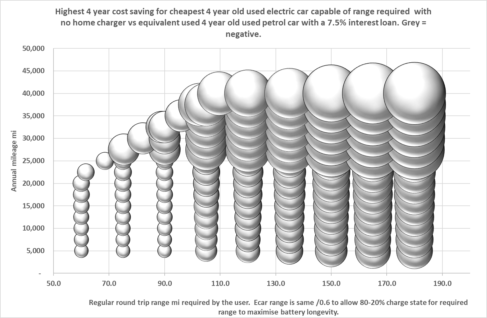
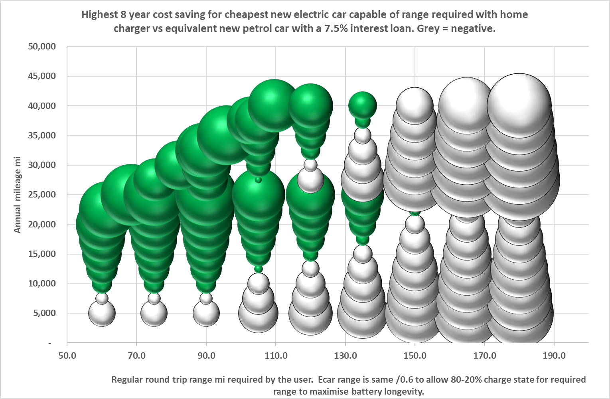
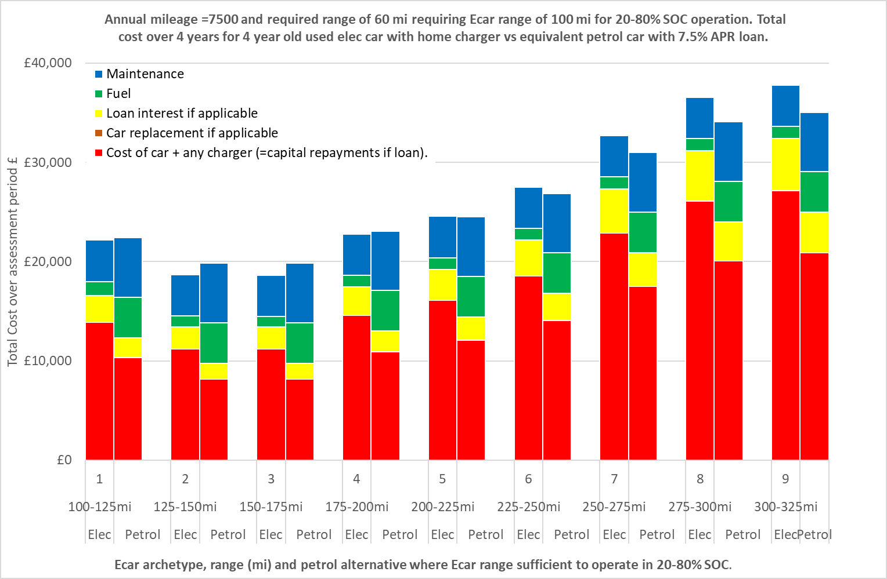
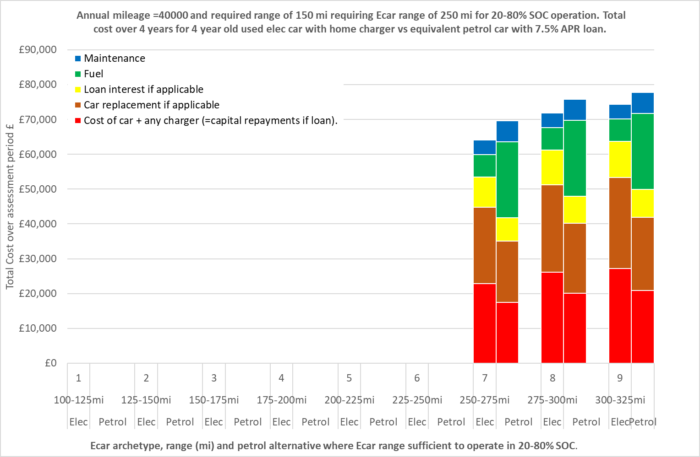
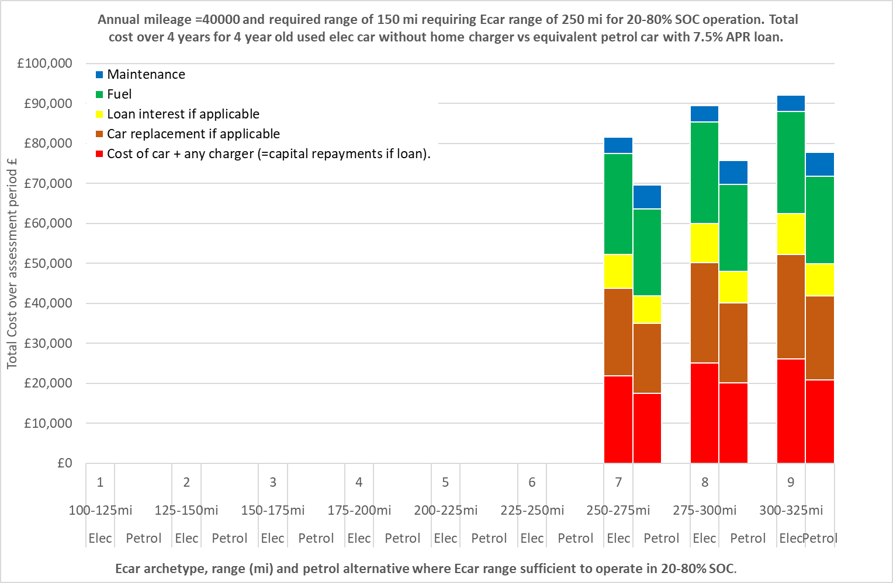
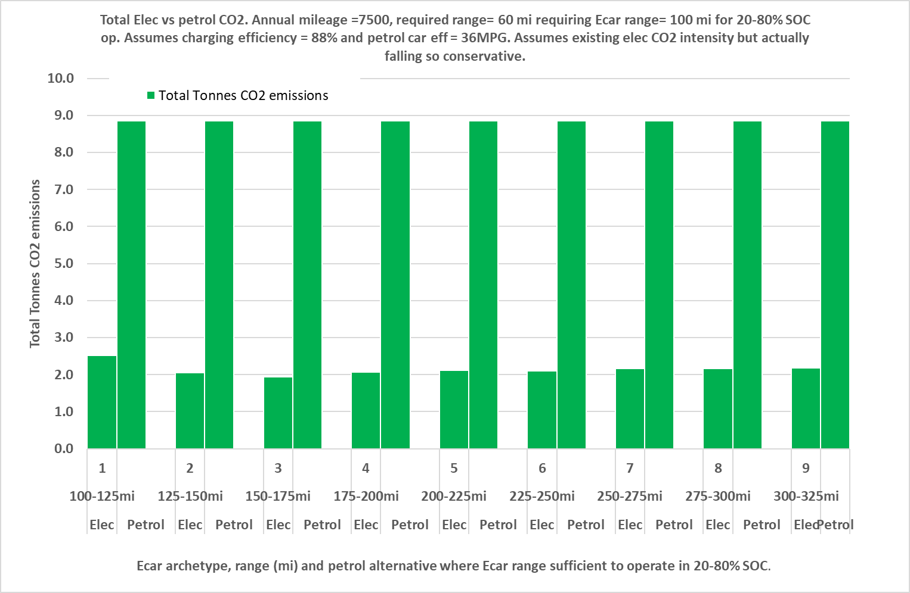

# Capstone_Evaluating_Domestic_Electrification_Measures 

**Capstone_Evaluating_Domestic_Electrification_Measures** is my final (capstone) project carried out in October 2025 as part of the Code Institute Data Analytics and AI Bootcamp.

I have saved all files in Github.  These include this readme file, raw and processed data files, Jupyter notebooks, and the Power BI dashboard (.pbix) file.

The project repository is located here:- 
https://github.com/jeremystambaugh305/Capstone_Evaluating_Domestic_Electrification_Measures

and the project planning is located here:-
https://github.com/users/jeremystambaugh305/projects/5

Context

The UK government is currently committed to reducing net carbon emissions to zero by 2050. Significant progress has been achieved to date in reducing the carbon emissions of power generation but less so in other areas such as heat generation and transport which currently use mainly fossil fuels in the UK. Electrifying heating and transport has emerged as a key strategy to decarbonise these sectors, i.e. replacing fossil fuelled vehicles with electric vehicles and fossil fuelled heating with electric heating. In a domestic setting, this would typically mean, acquiring an electric car (Ecar) rather than a conventional petrol or diesel car or installing an air source heat pump (ASHP) rather than a conventional gas or oil fired boiler. Typically this would be done when the householder needs or wishes to replace, or in some cases acquire for the first time, a car or heating system. Though not a necessity, installing a solar PV array (solarPV), typically on the roof, is another significant measure which will contribute in decarbonising the electricity supply and hopefully save the householder money over its lifetime.

# 

## Dataset Content
This project will use a number of datasets sourced from Kaggle, UK government, other public sources and at one private source (my smart meter). These will include techno-economic databases with costs and technical information for the various technology options, annual heating and electricity consumption statistics for different household categories, and half hourly electricity and gas consumption data.

All source datasets are expected to be well below the 100MB limit for an individual file in a Github repository using the standard free version of Github. However, cost and carbon savings will then be calculated for various scenarios within Jupyter notebooks which will output large csv files which will all be read into Power BI to facilitate the dashboards. I envisage having 3 csv files, one for Ecars, one for Solar PV and one for ASHPs and then just one Power BI file with multiple sheets so these 3 technologies can be readily compared without having to open dashboard files. Each of the csv files or the Power BI dashboard .pbix file could approach the 100MB limit. I will estimate the size of each of the csv files and of the pbix dashboard file based on dummy outputs and dashboards and monitor their size during development. I will tailor and where necessary, curtail the level of detail and formatting of outputs and underlying analysis to give the most informative insights possible within the 100MB file size limits. An initial trial of the Ecar csv file and loading this into Power BI, the pbix filesize displayed by Windows Explorer is only around 1/6th of the size displayed for the underlying csv file. This implies the pbix is likely to be well below 100MB even if it contains data from 3 csv files approaching 100MB. According to a Bing Copliot search this could be due to data compression in Power BI but it is also possible the file size did not correctly display in Windows Explorer so I will still need to monitor all file sizes closely in Github. 

The raw datasets used are as below:-

#### Cheapestelectriccars-EVDatabase_2023.csv
`Cheapestelectriccars-EVDatabase_2023.csv` is a techno-economic data (including up front costs, battery size, efficiency) obtained from Kaggle at https://www.kaggle.com/datasets/kkhandekar/cheapest-electric-cars. According to the documentation this was webscraped from another electrical vehicle database https://ev-database.org. `Cheapestelectriccars-EVDatabase_2023.csv` was produced in 2023 so is already outdated. For example as explained below, I found in web searches that UK prices have reduced substantially for many of these cars, some are no longer being sold in the UK and some new cars have entered the UK market. Due to the first point, costs and therefore lifetime savings which will be calculated using this dataset are likely to be conservative.  
Some cars did not have UK prices so I researched some online and found some had only recently entered the UK market and some have still not entered the UK market. So I assumed these were all not yet on the UK market in 2023 and removed them from the dataset.
Otherwise, I have kept to this dataset as it is, as I know of no more recent comprehensive set. I have not updated prices based on the few web searches I did as this would lead to inconsistencies and I did not have sufficient time budget to comprehensively update the dataset. But updating this dataset would be a potential significant future improvement.

I produced several visualisations in the Jupyter notebook to help examine and present the dataset. 

I examined two prominent cost outliers and identified them as luxury cars with their prices plausible based on web searches. So I retained these in the dataset expecting subsequent analysis to show their lifetime cost savings to be poor, though as explained in the ethical considerations section below I will avoid identifying these individually.

The dataset contains numerical data in various columns as strings including units, for example a column headed 'Range' contains strings such as '640 km', the longest range car sold in UK.  In such cases I created one or more additional columns to obtain the useful numerical information for further analysis. In this example I created one column headed 'Range_km' into which I parsed the integers (640 for this example row), then another column headed 'Range_mi' containing the ranges in float format converted to miles by dividing by 1.60934 (397.678551 for this example row) as I work with ranges in miles rather than km in the subsequent analysis.

#### Other_Dataset.abc
Abcde

## Business Requirements
* This project will aim to evaluate the current cost and carbon reduction potential for the following 3 major electrification measures available to households where none of these currently exists:

1. An electric car (Ecar)
2. A rooftop mounted solar PV array (Solar PV)
3. An air source heat pump (ASHP)

These are in my anticipated descending order of potential lifetime cost saving for an average home with gas heating and a petrol car.

Key data and outputs will be displayed in interactive dashboards using Power BI to visually demonstrate the up front costs, lifetime cost savings, and carbon saving potentials of each of these 3 measures.  The aim is to help households decide whether to proceed with one of these electriciation technologies and if so which one.  I will include all dashboards for all 3 key technologies within a single Power BI dashboard pbix file for ease of use and technology comparison.

It should be noted that the scope of this project and the resulting dashboard and underlying calculations and assumed existing energy profiles are intended to help a user without any of these 3 measures currently in place to the selection of just one of the three measures. The total benefit of implementing more than one of these measures could differ from the sum of the benefits calculated for each of the measures in isolation, but calculating such interactions is beyond the scope of this project and dashboard.

For example, if an Ecar is obtained and a home charger installed, there is potential for a solar PV array to help charge the Ecar when solar PV generation exceeds household electricity demand, thus reducing Ecar fuel costs. But such savings will depend on the duration the car is at home during times of significant solar generation, significant demands from other electrical appliances and whether the value of electricity saved (most likely at a night rate) exceeds the value of otherwise exporting the excess electricity. Solar PV electricity may similarly be used to supply ASHPs though this seems likely to be mostly limited to hot water heating due to relatively little time overlap between space heating demand and solar generation. It seems likely that Ecars and ASHPs would have little mutual benefit and the savings of both combined could be lower than the sum of each, for example if an economy 7 tariff is optimal for an Ecar charging overnight but a standard tariff is cheaper for an ASHP running mostly during the day. 

As mentioned above, analysis of such interactions is beyond the scope of this project. This dashboard should help a user to select the most beneficial standalone option. They could then calculate the amended gas or electricity consumption totals resulting from the selected measure, and use this same dashboard with the amended energy consumptions to evaluete the merits of the other 2 options. However the selected measure is likely to change the electricity consumption profiles, as well as the total gas or electricity consumption so the results could be inaccurate. 
The dashboard and underlying calculations would need to be extended to properly assess such combinations.

This will be a general tool covering a broad range of situations using datasets some of which are changing quickly so soon outdated, so it is advised that this be followed up with more detailed and focussed analyses using the latest data.

## Hypothesis and how to validate?
* I anticipate the following results but these will be evaluated in this project:-

1. Ecars, in particular secondhand, will have the most significant lifetime cost saving potential, but only in households where home charging can be installed. Cost savings will be greatly diminished, possibly negated, where home charging cannot be installed so the user has to do all charging with public chargers.

2. Solar PV will have moderate lifetime cost saving potential in households with high daytime occupancy, particularly if high energy electrical appliances are operated during high sunlight hours e.g. 10:00-14:00 GMT or 11:00-15:00 BST. But savings will be greatly diminished if daytime occupancy is low as current export values are low. Incorporating battery storage may improve this, but only slightly as batteries have high up front costs.

3. Based on my energy consultancy experience, ASHPs typically have little or no lifetime cost saving compared with gas heating as:-

i) The up front costs of ASHPs are substantially higher than gas boilers even with the current government boiler upgrade grant support scheme (BUS).

ii) The current ratio between domestic electricity and gas prices is typically higher than the ratio between seasonal ASHP and gas boiler efficiencies meaning ASHPs have higher annual fuel costs than gas boilers.
The above cost disadvanteges are offset to a degree by ASHPs having longer anticipated life spans and lower maintenance costs, but these advantages are typically less significant so unlikely to reverse the situation.

iii) All technologies will almost certainly reduce annual CO2 emissions and this saving will increase with time for Ecars and ASHPs but decrease for Solar PV as the UK grid decarbonisation continues. Calculating overall CO2 savings is complex as the CO2 intensity of electricity fluctuates with generation mix so this will ideally be calculated on a half hourly basis. For a household with a petrol car, a gas boiler and average car mileage and heating gas consumption, the direct (on site) emissions from petrol and gas are similar but Ecars are likely to have lower indirect (off site) CO2 emissions from generation and thus higher overall CO2 savings than ASHPs due to consuming less electricity than ASHPs and a greater proportion of it overnight when it is less CO2 intensive. But ASHPs could save more in households with a much lower than average ratio of car mileage to heating gas consumption.

## Project Plan

### What high-level steps were taken for the analysis?

For the ideation and wireframing of the Ecars dashboards, I developed charts and the underlying calculations in Microsoft Excel.

I researched and obtained suitable input data from Kaggle and other public sources, capturing the references, urls etc.

I created a high level Kanban board plan in Github projects.

### How was the data managed throughout the collection, processing, analysis and interpretation steps?

I saved datasets, e.g. `Cheapestelectriccars-EVDatabase_2023.csv` to a project folder within Windows exporer, then dragged relevant key datasets across to my project folder in vscode for loading.  Other data included one off numbers obtained from various sources which I referenced.

### Why did you choose the research methodologies you used?
I had extensive experience with assessing the cost effectiveness of ASHP, some for SOlar PV and little for Ecars but having considered all three for my own personal circumstances, I believed that Ecars offer the most potential for cost savings followed by Solar PV with ASHPs offering little cost saving potential, at least where gas heating is the alternative. I therefore spent most time and focus on Ecars then Solar PV and finally ASHPs.

#### Ideation use of Microsoft Excel
I carried out most of my ideation of dashboards, in particular for Ecars, by setting up calculations and charts in Excel before replicating calculations in the Jupyter notebooks and charts in Power BI. Developing ideas in Excel was more intuitive to me being familiar with the software and having extensive calculations in Excel did provide me with a good cross check on the results when I replicated them in the Jupyter notebook and Power BI dashboards. However, the latter applications are clearly much faster than Excel in processing and visualising the datasets so I will try to develop my ideas directly in Jupyter notebooks and Power BI in future projects and only use Excel as a simple check as seems appropriate.

## The rationale to map the business requirements to the Data Visualisations
* List your business requirements and a rationale to map them to the Data Visualisations

## Analysis techniques used
* List the data analysis methods used and explain limitations or alternative approaches.
* How did you structure the data analysis techniques. Justify your response.
* Did the data limit you, and did you use an alternative approach to meet these challenges?
* How did you use generative AI tools to help with ideation, design thinking and code optimisation?

## Ethical considerations
* I have not presented any cost savings or CO2 results for individually identifiable Ecars.  Even if all calculations and underlying assumptions were completely accurate doing so could carry legal risks, but many inaccuracies are inevitable given the following:-

i) My Ecar analysis is largely based on a dataset from Kaggle `Cheapestelectriccars-EVDatabase_2023.csv` which was scraped from another online database in 2023 so now outdated. I have not verified any of the scraped data for myself was in line with the source database as it was in 2023, if this is even possible. 

ii) I have used many other assumptions and data sources which have not been rigourously reviewed independently.

I therefore grouped actual Ecars into bins with different mileage ranges, calculated an archetype car for each with average range, price, battery size and efficiency, calculated and presented the cost and CO2 savings for these archetypes to be informative to users who would then research individual Ecars within these mileage range bins themselves.

* I have obtained half hourly electricity and gas consumption from my smart meter which I intend to use to calculate the cost and CO2 benefits of Solar PV and ASHPs, but showing the data directly could identify my family's occupancy patterns facilitating burglary etc. I will conduct some analysis offline, most likely the % of solar PV I could have used on site in that year and only use this key output in subsequent analysis. I will then select a representative day and repeat 365 times to create a synthetic dataset and perform the same analysis on this demonstrate how I analysed the actual dataset.

## Dashboard Design

I will create the main user dashboards using Power BI, the purpose being to inform a less technical user in their choice of Ecar, Solar PV or ASHP based on the potential for cost and CO2 savings and also on up front costs which may be a consideration.

I will calculate the key variables such as total cost and CO2 savings based on public data sources.

# Data analysis in Jupyter notebooks
I will use Python libraries within Jupyter notebooks to assess the suitability and relevance of key source datasets, and also to calculate cost and CO2 savings under various scenarios, using the key datasets along with other referenced data points and assumptions. 

Having calculated the cost and CO2 savings in Jupyter notebooks for all scenarios which I envisage will underpin my Power BI dashboards, I will statistically assess the cost savings as target variables against source, assumed and scenario variables as feature variables to quantify the importance of the different variables and strength of correlation with cost savings. I will use my findings to inform my final decisions on which results to present in the Power BI dashboards.

# Power BI dashboards
Subject to the findings of statistics on my calculated cost savings (and CO2 savings if appropriate) I propose the following Power BI dashboards:-

# Ecars

1) a main dashboard bubble plot showing total cost savings of the cheapest or most cost effective Ecar for each mileage range and annual mileage combination (lowest up front or total cost depending on user selection) on a 2 dimensional plot with range and annual mileage on the x and y axes respectively and total savings shown by bubble size and colour. I developed the idea in Excel as shown below but this may look diferent, hopefully better in Power BI where savings would also be demonstrated with colour shading and negative values in red scale rather than grey.

Examples

The first example shows the most favourable situation where a user has the ability to install a home charger, is looking for a 4 year old secondhand Ecar or an equivalent petrol car (as opposed to cheapest petrol car available) without requiring a loan.  For a given range requirement, the higher the annual mileage the higher the annual saving up to a certain annual mileage where this falls due to the requirement for a replacement car within the timescale examined before rising again with annual mileage.  Most Ecars will result in savings even with low annual mileage except for the very largest cars which will require a slightly higher annual mileage to result in savings.

The second example is as the first, except that the user requires a loan to buy the Ecar or the petrol alternative, at an APR of 7.5%, a fairly typical current rate for this amount of money.  This shows a reduction in the range of circumstances for which an Ecar would result in a saving compared with the petrol alternative and also a reduction in the savings where it is still cost effective.

The third example is as the second example, except that the user does not have the ability to install a home charger, e.g. they do not have a driveway adjacent to their home.  In this scenario Ecars will not save money compared with their petrol alternative for any range requirement or annual mileage scenarios, showing how critical access to a home charger is to the financial viability of an Ecar.

The final example is as the second, except the user wishes to purchase a new car rather than secondhand.  This indicates savings are more likely for smaller Ecars.

In the above examples it was simply assumed that an equivalent petrol car would cost 80% of the cost of a new Ecar, i.e. an Ecar costs 25% more which is a typical ratio currently but this premium is likely to differ between small and large cars and narrow generally in the future, so a future improvement would be to review which petrol cars are equivalent to each size of Ecar and obtain new and used cost data.

To accommodate this uncertainty, I will also consider adding an option to allow the user to select between a ratios of 80% or 100% will also be added to the dashboard, doubling the number of calculations.

This main dashboard allows users to quickly and flexibly see a map of all range and annual mileage scenarios, which are most favourable, if well known, the point on the map the range and annual mileage sits, or if uncertain the region of applicable scenarios to judge how much the cheapest or most cost effective Ecar would save them over 8 years if buying new or over 4 years if buying 4-year old used car(s). This includes the cost of buying a replacement car during the assessment timescale which is necessary for the high annual mileage scenarios (>25,000 miles for new cars and >12,500 miles for used cars which are assumed to last 200,000 and 100,000 miles respectively).

Selectable user variables:-

a) If the user can install a home charger or not.
b) If the Ecar is new or used (4 year old).
c) If Ecar and counterfactual petrol car would be bought with cash or a loan with 7.5% APR
d) If the alternative petrol car is assumed to be an equivalent with a price of 80%* of the Ecar, or the cheapest petrol car available.
e) If the electric car has a high or average charging efficiency (100 or 88%**)
f) If the alternative petrol car has a high or average efficiency of 50MPG or 36MPG***
g) If anticipated maintenance cost saving is low/med or high.

Also

h) If the cheapest Ecar archetype for each annual mileage and range and above scenario combination is selected based on up front or total costs over the assessment timescale of 8 or 4 years for new or used, though this could be calculated in a seperate table with only the total savings for the best archetype for each of these 2 options to reduce overall data volume.

* Typically 80% according to the Electric Car Scheme
https://www.electriccarscheme.com/blog/electric-cars-vs-petrol-cars-the-ultimate-debate

But may be higher for used cars according to carbuyer.  If 100% then Ecars will save money in all cases due to lower up front and also running costs, so this was not modelled as it would again double the data volume and conclusion is obvious.

https://www.carbuyer.co.uk/car-buying/305896/used-ev-bargains-data-suggests-evs-are-cheaper-than-petrol-cars-on-the-used

**Review by Which 

https://www.which.co.uk/reviews/new-and-used-cars/article/electric-car-charging-guide/how-much-does-it-cost-to-charge-an-electric-car-a8f4g1o7JzXj

***Review by Nimblefins

https://www.nimblefins.co.uk/cheap-car-insurance/average-mpg

The above examples represent just 4 of the above combinations of which there are 2*2*2*2*3*2*2*2 = 384. Results for all 384 combinations will be pre calculated in Jupyter notebook and loaded into Power BI where they would be filtered based on user selections.  The result will be analysed, e.g. with correlation matrices, to assess the sensitivity of cost savings to other variables. If data volume leads to slow calculation or the output csv file exceeding the 100MB Github limit, variations on the variables with least impact and the ability to amend these in the dashboard will be removed to reduce data volume.

2. User specific interactive dashboards, filtered on user selections:-

i) A stacked cluster column chart with up to 9 pairs of stacked bars (one for each Ecar archetype capable of a user selected range requirement), showing the total costs for the suitable archetype Ecars and their petrol alternatives over 8 or 4 years for new or used cars, comprising 

a) Up front costs including charger if applicable
b) Replacement costs if applicable
c) Any loan interest if applicable
b) Total fuel costs
c) Total maintenance costs

Examples 

The user in each example is looking to buy a 4 year old secondhand car with a loan. 

The first example shows a user with a near average annual mileage of 7,500 and a low range requirement of only 60 miles and ability to install a home charger. Total 4 year mileage is less than the assumed remaining 100,000 mile life of the used car so no replacements are required. Ecar archetypes 1-4 have a total cost saving compared with an equivalent electric car.  The archetype with the lowest up front and total cost is either 2 or 3, it's unclear which from the graph. Archetype 5 has a similar total cost to it's petrol alternative. But archetypes 6-9 do not save money, their petrol alternatives having lower total costs.

The second example shows a user with a higher annual mileage of 20,000 with a higher range requirement of 120 miles, e.g. a 60 mile commute each way with no workplace charging, and ability to install a home charger. Again the total 4 year mileage is less than the assumed remaining 100,000 mile life of the used car so no replacements are required. Only archetypes 5-9 can meet this range requirement and archetype 5 has the lowest up front and total cost of all Ecars, and all Ecars save money overall, having lower total costs than their petrol alternatives.

The third example is a high annual mileage (40,000) high range 150mi requirement user with the ability to install a home charger.  The total 4 year mileage exceeds the assumed remaining 100,000 mile life of the used car so a replacement is required in the 4 year timeframe. Only archetypes 7, 8 and 9 have sufficient range and they all save money overall, having lower total costs than their petrol alternatives, archetype 7 having the lowest cost.

The final example is the same as the third but where the user has no ability to install a home charger. As well as having higher up front costs, without home charging, Ecars also have slightly higher fuel costs since all charging is with public chargers so despite slightly lower maintenance costs, the total costs of Ecars is higher for all suitable archetypes.

These charts give a visual comparison of the relative up front, replacement and interest costs, fuel and maintenance costs and total costs of suitable Ecars and their petrol alternatives, with different mileage ranges exceeding the user's requirement with the user selected combination of other variables such as whether it is possible to install homecharger, whether a loan is required etc.

The cheapest overall Ecar will typically be one of the smallest suitable but sometimes not the smallest, as a slightly larger car may be more efficient or cost effective. However, a user may desire or need a much larger car, for other reasons, e.g. for space or comfort or safety. The dashboard only indicates car size in terms of range so a user would need to consider actual individual cars but they could then compare a desired Ecar's range with an archetype of similar range to compare the costs of such an Ecar with it's petrol alternative.

ii) A combo column and line chart showing the fuel cost per mile for Ecars at various domestic and public charging rate electricity prices on the x-axis, with two horizontal lines showing the costs per mile for petrol cars with medium and high efficiencies (50/36MPG).

iii) A cluster column chart showing the annual CO2 emissions resulting from each of the 9 Ecar archetypes and it's petrol alternative.

For Ecars, the CO2 is generated at power stations supplying the electricity rather than at source as for petrol cars.

For example 

In both examples I assumed an annual mileage of 7,500 and a range requirement of 60 miles requiring an Ecar range of 100 miles, hence all archetypes are suitable.
In the first example I assumed a high Ecar charging efficiency of 100% and a high petrol car efficiency of 50 miles to the gallon (MPG) as in previous examples above but in the second example I assumed average charging and petrol car efficiencies of 88% and 36MPG respectively.

In all cases electric cars result in much lower CO2 emissions than petrol cars.

The following should be noted:-

1. The CO2 intensity of electricity (kg CO2 per kWh) has been falling significantly in recent years and is expected to continue falling in line with net zero targets. Future falls are uncertain but it is very clear that current CO2 emissions from Ecars are much lower than those of petrol cars so for simplicity I have assumed CO2 intensity will remain at current levels through the assessment timescale. This is conservative but matters little since the CO2 saving is already clear.

2. The CO2 intensity of electricity varies with time of day and is typically lower at night so this will typically be lower when most of the charging is done overnight, e.g. when a home charger can be installed and when the battery is small enough to be completely charged overnight. It also depends on the generators assumed to supply an Ecar and if these are:-

i)  The most CO2 intensive generators on the grid at any point in time (typically gas-fired)

ii) A share of all types of generator on the grid at any point in time.

I have used the electricity CO2 intensity factors provided by the UK government Greenhouse Gas Inventory which is based on the latter.

https://assets.publishing.service.gov.uk/media/6722566a3758e4604742aa1e/ghg-conversion-factors-2024-condensed_set__for_most_users__v1_1.xlsx

A potential future refinement would be to model and compare CO2 intensity depending on the charging times of the different scenarios and take account of predicted future changes to the generation mix. this would not change the clear fact that Ecars result in significantly lower CO2 emissions than petrol cars but could affect any comparisons of the CO2 saving potential for Ecars with those of Solar PV and ASHPs.

However, refining the parameters affecting cost saving calculations for Ecars and also the other technologies below is probably a higher priority as this is most likely to determine which if any of these options is implemented.

# SolarPV

Similar to those for Ecars above, I propose having

1) A main bubble chart overview dashboard showing solar panel size and annual electricity consumption on the x and y axes and with the bubble size and colour in line with total savings over the PV array lifetime.

I propose allowing the following user selectable variables to alter this main dashboard:-

a) The number of days per week the house is occupied by someone during the majority of the time between 09/10 and 15/16 GMT when most solar power is generated.

b) Location from a list of x UK regions which will affect the number of kWh which can be generated per kW capacity.

2) User specific interactive dashboards allowing the user to also select:-

a) their annual electricity consumptions from a list e.g. 2,500, 2,750, 3,000, .... 5,000 kWh

b) ???

And based on this create dashboards showing

i) A stacked cluster chart showing up front Solar PV costs, total lifetime maintenance and electricity costs (net of electricity sold back to suppliers through the smart export guarantee) and the alternative total electricity costs without a solar PV side by side.

ii) A cluster chart showing total CO2 emissions associated with all electricity generated by PV and consumed by the household with and without Solar PV.

As with Ecars the average existing electricity CO2 intensity for 2025 will be assumed, based on the UK greenhouse gas inventory, but in reality this is falling year on year, changes with time of day and depending on which generators would supply each unit of household consumption with and without solar PV. Taking account of this would be a further refinement.

# ASHPs
As mentioned above I do not anticipate much liklihood of domestic ASHPs being cost effective for a typical UK user who has conventional gas heating.  

I propose the following main dashboards

i) A cluster column chart showing the up-front cost, replacement cost, fuel cost and maintenance cost for ASHP installations and their gas boiler alternatives side by side for a range of different annual gas consumption levels increasing on the x axis 
e.g. 7,500, 10,000, 12,500 ... 40,000 kWh. Energy prices will calculated internally, based on gas consumption, typical electricity consumption, and UK Quarterly Energy Reports.  The user will be able to select their annual gas consumption from the bar chart and select high/med or low ASHP efficiencies (SCOPs) which will change the bar charts.

ii) A cluster chart showing CO2 emissions for ASHPs and their gas boiler alternatives.  As with Ecars, this should show very significantly lower CO2 emissions with ASHPs.

As with Ecars I propose to assume the average existing electricity CO2 intensity for 2025, based on the UK greenhouse gas inventory, but in reality this is falling year on year, changes with time of day and depending on which generators would supply each unit of ASHP consumption. ASHPs consume more electricity in winter and during waking hours when it often has a higher CO2 intensity. Taking account of this would be a further refinement.

Other charts at time allows could include:-

A cluster column chart showing annual ASHP electricity and gas boiler fuel costs side by side  for high, med and low ASHP efficiencies (SCOPs) with electricity and gas prices at the selected gas consumption level.

A cluster column chart showing annual ASHP electricity and gas boiler fuel costs side by side for various electricity/gas price ratios centred on the typical range at the selected high/med/low ASHP efficiency (SCOP).

* Later, during the project development, you may revisit your dashboard plan to update a given feature (for example, at the beginning of the project you were confident you would use a given plot to display an insight but subsequently you used another plot type).
* How were data insights communicated to technical and non-technical audiences?
* Explain how the dashboard was designed to communicate complex data insights to different audiences. 

## Unfixed Bugs
* Please mention unfixed bugs and why they were not fixed. This section should include shortcomings of the frameworks or technologies used. Although time can be a significant variable to consider, paucity of time and difficulty understanding implementation are not valid reasons to leave bugs unfixed.
* Did you recognise gaps in your knowledge, and how did you address them?
* If applicable, include evidence of feedback received (from peers or instructors) and how it improved your approach or understanding.

## Development Roadmap
* What challenges did you face, and what strategies were used to overcome these challenges?
* What new skills or tools do you plan to learn next based on your project experience? 

## Deployment
### Power BI

* The dashboards will be created using Power BI with the pbix files uploaded to this repository.

## Main Data Analysis Libraries
* I will use the following Python libraries:-

1. NumPy
2. Pandas
3. MatPlotLib
4. Seaborn

## Credits 

* In this section, you need to reference where you got your content, media and extra help from. It is common practice to use code from other repositories and tutorials, however, it is important to be very specific about these sources to avoid plagiarism. 
* You can break the credits section up into Content and Media, depending on what you have included in your project. 

### Templates

- This repository structure, the Jupyter notebooks and this readme were created by adapting the Code Institute's repository and readme templates which can currently be found at the following locations.

https://github.com/Code-Institute-Solutions/da-README-template
https://github.com/ci-student/data-analytics-template

## Acknowledgements (optional)
* Thanks to all staff at Code Institute involved in teaching and facilitating the Data Analytics and AI course from Jun-Oct 2025, providing me with the IT knowledge and tools required for this project and for support and understanding given to me. In particular Vasi and Paul. Thanks also to fellow cohort students who helped me on various occasions, in particular Mike.